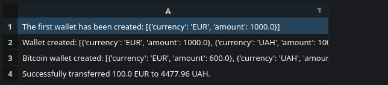

.png)

Your wallets can now be stored in the terminal!


# API:
In this project, i used the following API:

 


* ExchangeRate API: Used to get the latest exchange rates.

* CoinGecko API: Provides cryptocurrency data.

# Features:
*  ## Colorama
    Used the `colorama` module to render the color logo

    ```python
    print('')
    print(rf'{Fore.GREEN}$$\      $$\         $$\      $$\           $$\ $$\            $$\     {Style.RESET_ALL}')
    print(rf'{Fore.GREEN}$$$\    $$$ |        $$ | $\  $$ |          $$ |$$ |           $$ |    {Style.RESET_ALL}')
    print(rf'{Fore.GREEN}$$$$\  $$$$ |        $$ |$$$\ $$ | $$$$$$\  $$ |$$ | $$$$$$\ $$$$$$\   {Style.RESET_ALL}')
    print(rf'{Fore.GREEN}$$\$$\$$ $$ |$$$$$$\ $$ $$ $$\$$ | \____$$\ $$ |$$ |$$  __$$\\_$$  _|  {Style.RESET_ALL}')
    print(rf'{Fore.GREEN}$$ \$$$  $$ |\______|$$$$  _$$$$ | $$$$$$$ |$$ |$$ |$$$$$$$$ | $$ |    {Style.RESET_ALL}')
    print(rf'{Fore.GREEN}$$ |\$  /$$ |        $$$  / \$$$ |$$  __$$ |$$ |$$ |$$   ____| $$ |$$\ {Style.RESET_ALL}')
    print(rf'{Fore.GREEN}$$ | \_/ $$ |        $$  /   \$$ |\$$$$$$$ |$$ |$$ |\$$$$$$$  \$$$$  | {Style.RESET_ALL}')
    print(rf'{Fore.GREEN}\__|     \__|        \__/     \__| \_______|\__|\__| \_______| \____/  {Style.RESET_ALL}')
    print(r'')
    print(r'')

    ```
*  ## Openpyxl
    Used to create transaction history

    ### Python: 
    ```python
    sheet = workbook_transaction.active
    sheet.title = 'Transactions'

    for index, transaction in enumerate(transactions):
        sheet[f'A{index + 1}'] = transaction

        workbook_transaction.save("Transactions.xlsx")

        print('The file is saved to the root project folder.')

    ```
    ### Excel example:
    

# How to start?
1. Clone the repository
    ``` bash
    git clone https://github.com/Marchello-Projects/M-Wallet.git
    ```

2. Register on the website: https://www.exchangerate-api.com/ and copy the API key from there. Create a .env file in the project folder.

    ## Linux/Mac:
    ``` bash
    touch .env
    ```
    ## Windows:
    ``` powershell
    type nul > .env
    ```

    Then assign the API key to the variable
    ```
    API_KEY_EXCHANGE_RATE="Your API key"
    ```
3. Create a virtual environment and install dependencies
    ## Linux/Mac:
    ``` bash
    python3 -m venv venv
    source myenv/bin/activate
    pip install python-dotenv openpyxl requests colorama
    ```
    ## Windows:
    ``` powershell
    python3 -m venv venv
    myenv\Scripts\activate
    pip install python-dotenv openpyxl requests colorama
    ```

4. Run the code
    ```
    python main.py
    ```
5. Deactivate the virtual environment
    ``` 
    deactivate
    ```
